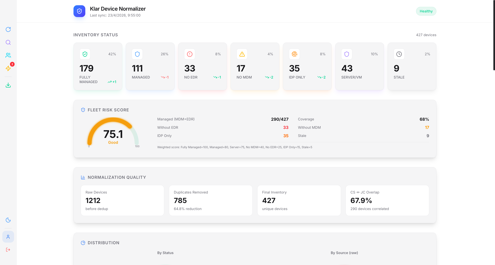
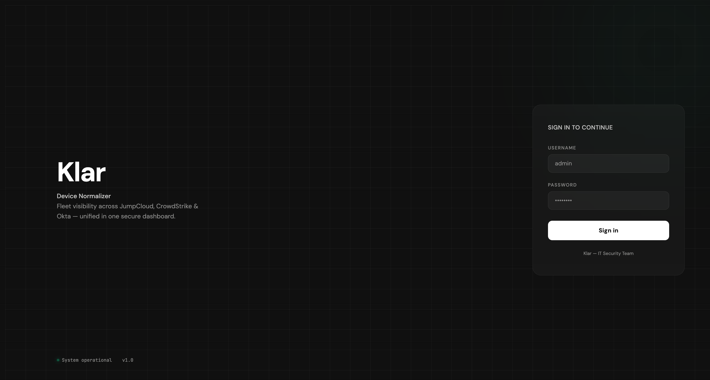
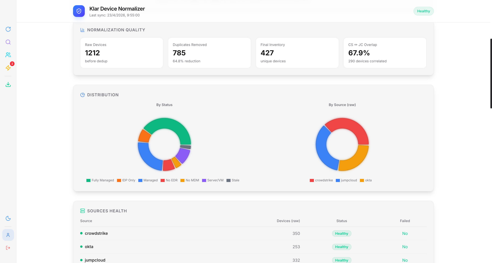
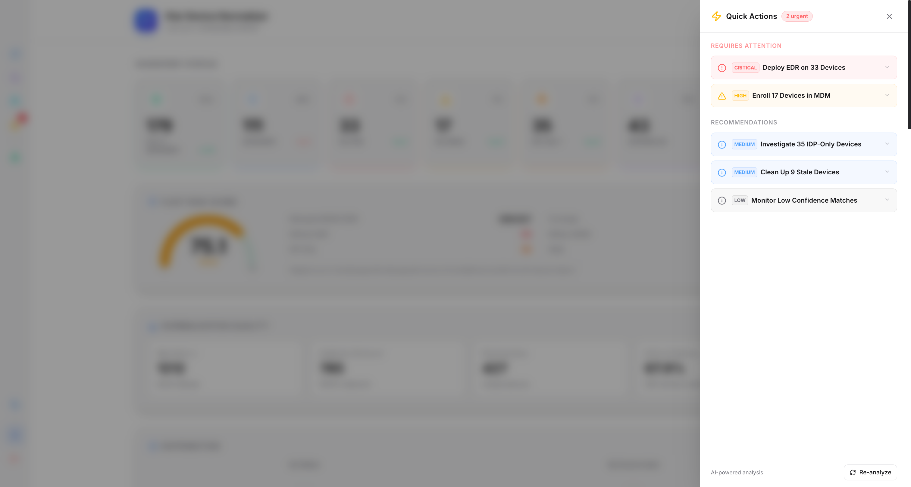
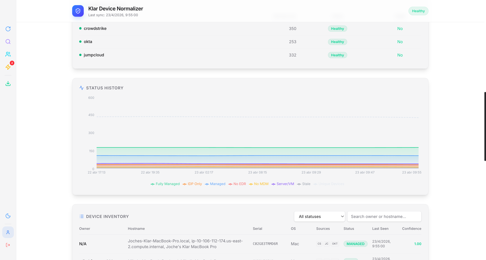
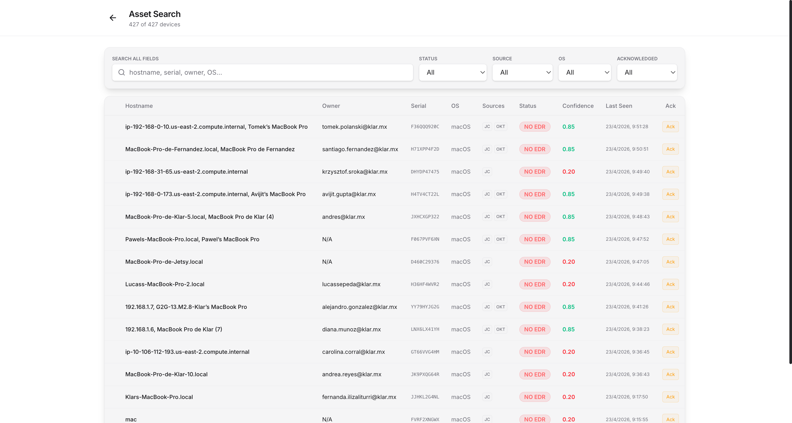
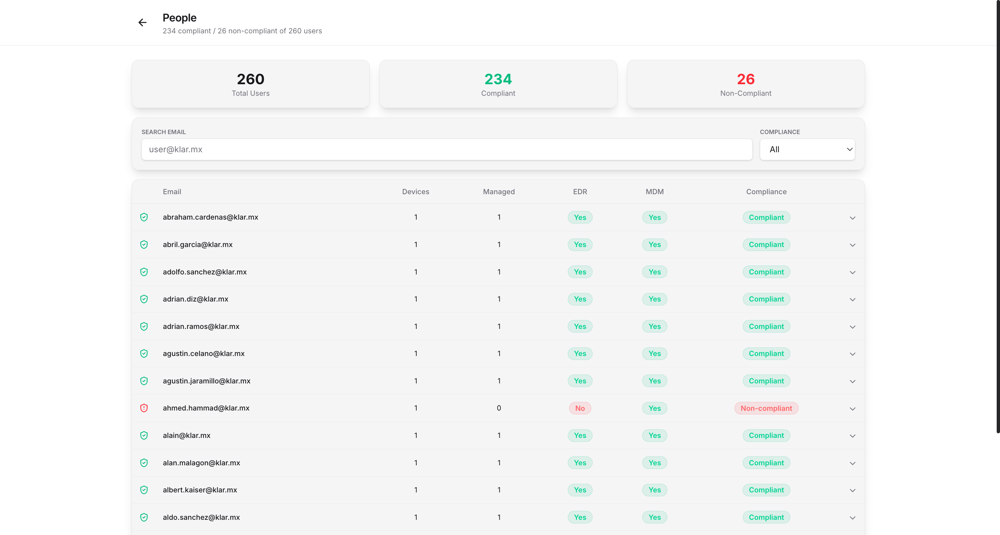

# Klar Device Normalizer

> **🌐 Language / Idioma:** [English](README.md) | [Español](README.es.md)

Visibilidad del parque de dispositivos a través de JumpCloud (MDM), CrowdStrike (EDR) y Okta (IDP) — unificado en un dashboard seguro.



## Qué hace

Recolecta datos de dispositivos de tres fuentes en paralelo, deduplica por serial/MAC/owner/hostname y normaliza en un inventario unificado de activos para dispositivos desktop/laptop. Los dispositivos móviles se filtran automáticamente.

### Modelo de Estados

| Estado | Significado |
|--------|-------------|
| **FULLY_MANAGED** | JumpCloud + CrowdStrike + Okta + owner asignado |
| **MANAGED** | JumpCloud + CrowdStrike (el baseline operativo) |
| **NO_EDR** | En JumpCloud pero sin CrowdStrike |
| **NO_MDM** | En CrowdStrike pero sin JumpCloud |
| **IDP_ONLY** | Solo en Okta — posible shadow IT |
| **SERVER** | Servidores/VMs con CrowdStrike (no necesitan MDM) |
| **STALE** | Sin actividad en más de 90 días |

### Funcionalidades

- **Dashboard** con cards de estado, gauge de riesgo, pie charts, historial
- **Insights con IA** via OpenAI (Quick Actions con recomendaciones priorizadas)
- **Matching de dispositivos con IA** para registros de baja confianza (correlación cross-source)
- **Búsqueda de activos** con filtros por estado, fuente, OS y búsqueda full-text
- **Vista de personas** — compliance por persona: quién tiene dispositivos managed y quién no
- **Acknowledge** de dispositivos para excluirlos de métricas (contingencia, test)
- **Reporte PDF** con resumen ejecutivo, gráficos, listas de dispositivos y branding Klar
- **Exportación** a CSV y Excel con estados coloreados
- **Alertas en Slack** después de cada sync: dispositivos nuevos, desapariciones, stale
- **Detección de servidores/VMs** — clasifica automáticamente infraestructura por patrones de hostname
- **Login** con usuario/contraseña (sesiones JWT, preparado para HTTPS)

## Screenshots

### Login


### Dashboard — Cards de Estado, Risk Score y Métricas de Calidad


### Gráficos de Distribución y Salud de Fuentes


### Quick Actions (con IA)


### Inventario de Dispositivos


### Búsqueda de Activos


### Personas — Vista de Compliance


## Inicio Rápido

### Local

```bash
# Clonar
git clone https://github.com/safernandez666/klar-assets.git
cd klar-assets

# Python
python -m venv .venv
source .venv/bin/activate
pip install -r requirements.txt

# Frontend
cd frontend && npm install && npm run build && cd ..

# Configurar
cp .env.example .env
# Editar .env con tus API keys

# Ejecutar
python main.py
```

Abrir http://localhost:8080

### Docker

```bash
# Build
docker build -t klar-device-normalizer .

# Ejecutar
docker compose up -d

# Logs
docker compose logs -f
```

## Configuración

Copiar `.env.example` a `.env` y completar:

| Variable | Requerida | Descripción |
|----------|-----------|-------------|
| `CS_CLIENT_ID` | Sí | CrowdStrike API client ID |
| `CS_CLIENT_SECRET` | Sí | CrowdStrike API client secret |
| `CS_BASE_URL` | Sí | CrowdStrike API base URL |
| `OKTA_DOMAIN` | Sí | Dominio de Okta (ej: klar.okta.com) |
| `OKTA_API_TOKEN` | Sí | Token de API de Okta |
| `JC_API_KEY` | Sí | API key de JumpCloud |
| `APP_URL` | No | URL pública (default: http://localhost:8080) |
| `AUTH_USERNAME` | No | Usuario de login (default: admin) |
| `AUTH_PASSWORD` | No | Contraseña de login (vacío = auth deshabilitado) |
| `JWT_SECRET` | No | Clave de firma de sesión (auto-generada si vacía) |
| `OPENAI_API_KEY` | No | Habilita insights con IA y matching de dispositivos |
| `SLACK_WEBHOOK_URL` | No | Habilita alertas en Slack después de cada sync |
| `SYNC_INTERVAL_HOURS` | No | Intervalo de sync automático (default: 6) |
| `SYNC_ON_STARTUP` | No | Sync al iniciar el server (default: true) |
| `WEB_HOST` | No | Dirección de bind (default: 0.0.0.0) |
| `WEB_PORT` | No | Puerto (default: 8080) |

## Endpoints de API

| Endpoint | Método | Descripción |
|----------|--------|-------------|
| `/api/devices` | GET | Todos los dispositivos (filtrable por status/source) |
| `/api/summary` | GET | Conteo de estados + risk score |
| `/api/trends` | GET | Cambios vs sync anterior |
| `/api/history` | GET | Snapshots históricos de estados |
| `/api/gaps` | GET | Dispositivos agrupados por gap de cobertura |
| `/api/insights` | GET | Quick actions generados por IA |
| `/api/people` | GET | Vista de compliance por persona |
| `/api/user/{email}/compliance` | GET | Verificar si un usuario tiene dispositivo managed |
| `/api/dual-use` | GET | Usuarios con dispositivos corporativos + personales |
| `/api/export/csv` | GET | Exportación CSV (filtrable) |
| `/api/export/xlsx` | GET | Exportación Excel con estados coloreados |
| `/api/report/full` | GET | Reporte estructurado completo para PDF |
| `/api/sync/trigger` | POST | Disparar sync manual |
| `/api/sync/last` | GET | Detalles del último sync |
| `/api/slack/test` | POST | Enviar alerta de prueba a Slack |
| `/api/devices/{id}/ack` | POST | Acknowledge de dispositivo |
| `/api/devices/{id}/ack` | DELETE | Remover acknowledge |

## Stack Tecnológico

- **Backend**: Python, FastAPI, SQLite, APScheduler
- **Frontend**: React, Vite, Tailwind CSS v4, Recharts, Framer Motion
- **IA**: OpenAI GPT-4o-mini (insights, matching de dispositivos, reportes PDF)
- **Integraciones**: CrowdStrike Falconpy, Okta API, JumpCloud API, Slack Block Kit

## Arquitectura

```
Collectors (paralelo)          Motor de Dedup       AI Matcher         Enricher
┌─────────────┐
│ CrowdStrike │──┐
├─────────────┤  │   ┌──────────────┐   ┌───────────┐   ┌──────────┐
│   Okta      │──┼──▶│ Serial/MAC/  │──▶│  OpenAI   │──▶│ Status   │──▶ SQLite
├─────────────┤  │   │ Owner/Host   │   │ matching  │   │ Gaps     │
│ JumpCloud   │──┘   └──────────────┘   └───────────┘   └──────────┘
└─────────────┘
                                                              │
                              ┌────────────────────────────────┘
                              ▼
                    FastAPI + React Dashboard
                    Alertas Slack │ Reportes PDF
```
