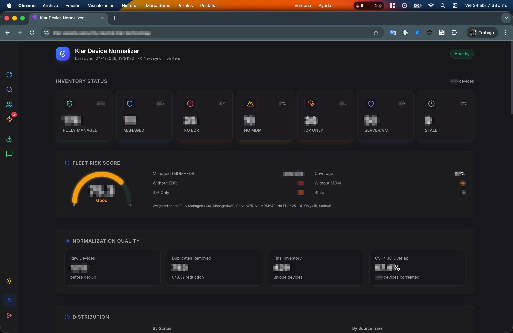
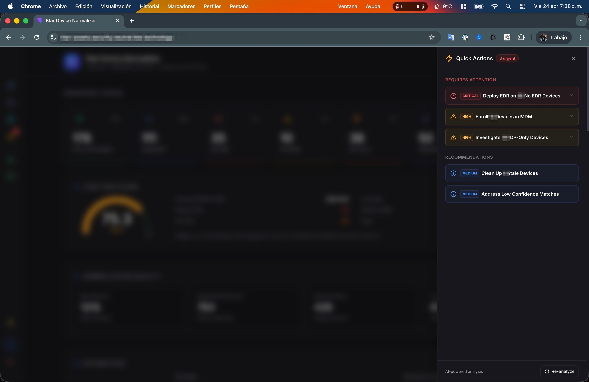
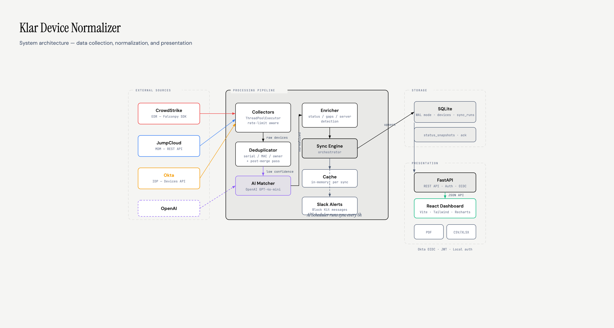
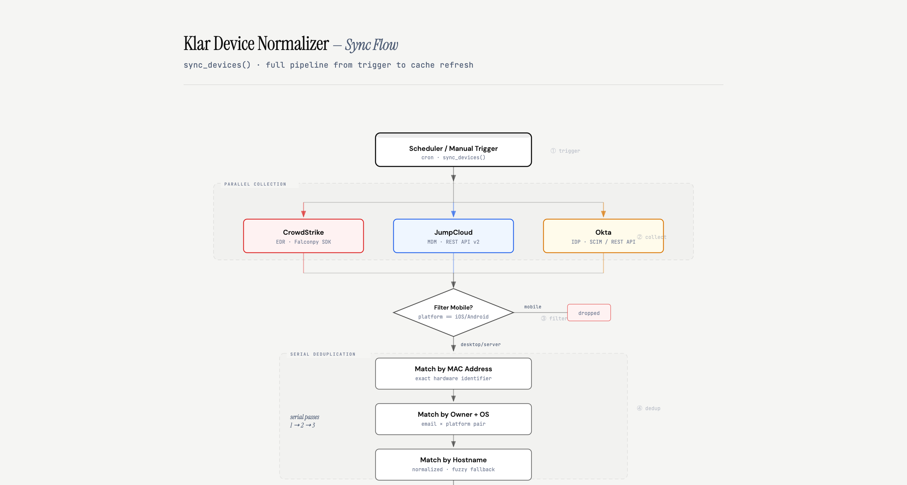
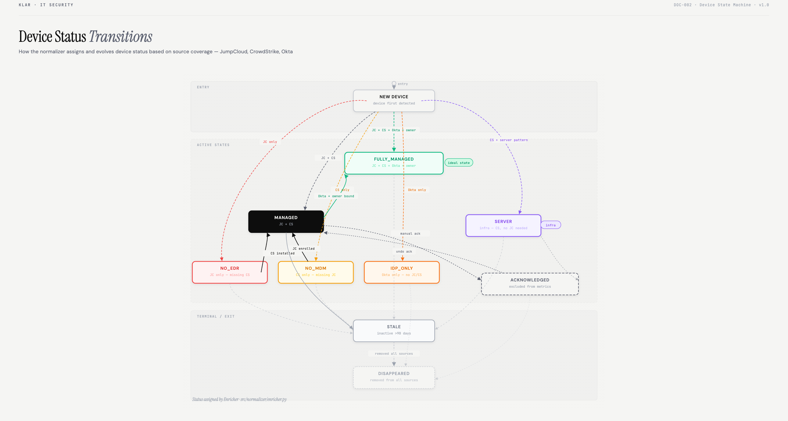
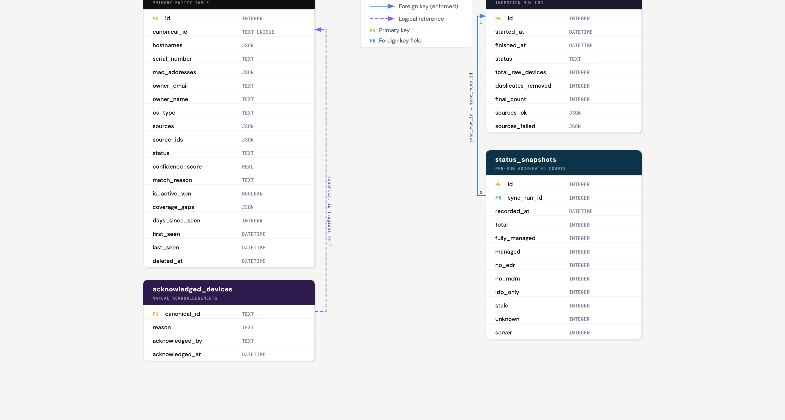
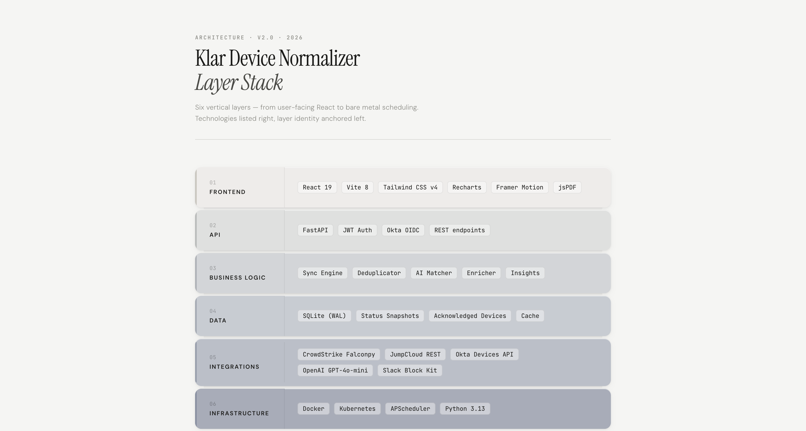
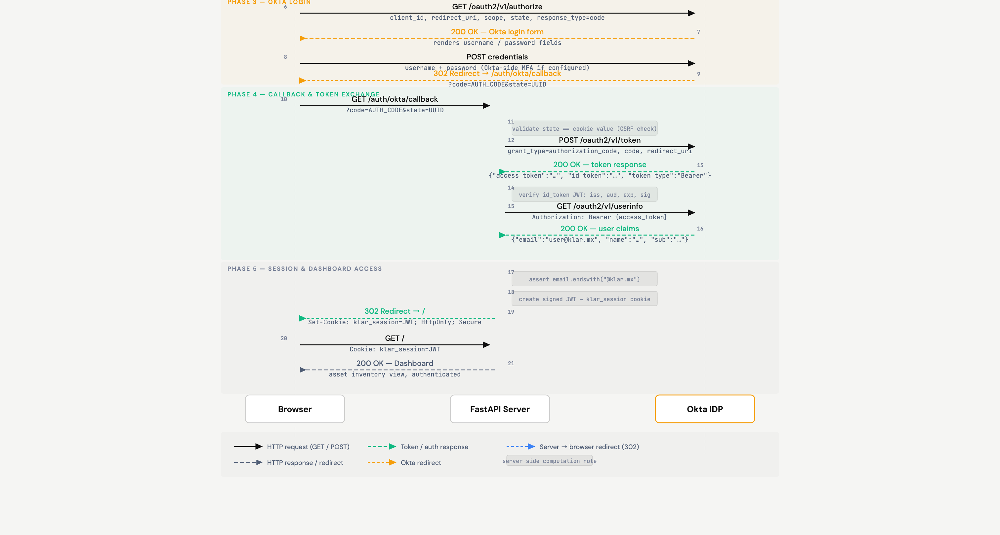
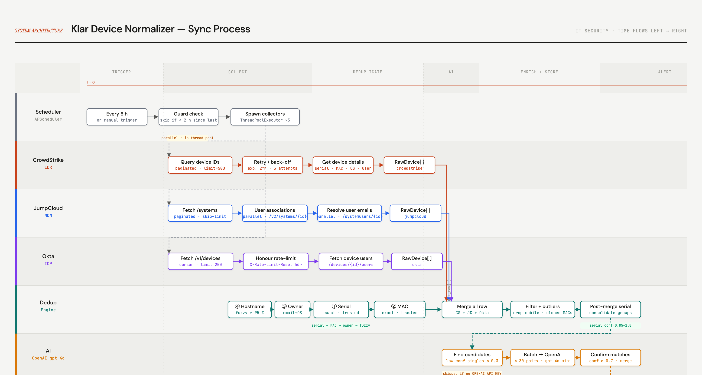
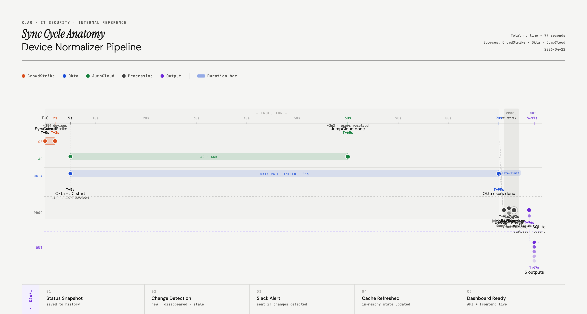

# Device Normalizer

> **🌐 Language / Idioma:** [English](README.md) | [Español](README.es.md)

Fleet visibility across JumpCloud (MDM), CrowdStrike (EDR) & Okta (IDP) — unified in one secure dashboard.

## What it does

Collects device data from three sources in parallel, deduplicates by serial/MAC/owner/hostname, and normalizes into a unified asset inventory for desktop/laptop devices. Mobile devices are filtered out.

### Status Model

| Status | Meaning |
|--------|---------|
| **FULLY_MANAGED** | JumpCloud + CrowdStrike + Okta + owner assigned |
| **MANAGED** | JumpCloud + CrowdStrike (the operational baseline) |
| **NO_EDR** | In JumpCloud but missing CrowdStrike |
| **NO_MDM** | In CrowdStrike but missing JumpCloud |
| **IDP_ONLY** | Only in Okta — potential shadow IT |
| **SERVER** | Servers/VMs with CrowdStrike (don't need MDM) |
| **STALE** | Not seen in 90+ days |

### Features

- **Dashboard** with status cards, risk score gauge, pie charts, history chart
- **AI-powered insights** via OpenAI (Quick Actions with prioritized recommendations)
- **AI device matching** for low-confidence records (cross-source correlation)
- **Asset Search** with filters by status, source, OS, and full-text search
- **People view** — person-centric compliance: who has managed devices, who doesn't
- **Acknowledge** devices to exclude them from metrics (contingency, test devices)
- **PDF report** with executive summary, charts, device lists, and custom branding
- **Export** to CSV and Excel with colored statuses
- **Slack alerts** after each sync: new devices, disappearances, stale devices
- **Server/VM detection** — auto-classifies infrastructure by hostname patterns
- **Login** with username/password (JWT sessions, HTTPS-ready)

## Screenshots

### Dashboard


### Quick Actions (AI-powered)


## Quick Start

### Local

```bash
# Clone
git clone https://github.com/safernandez666/device-normalizer.git
cd device-normalizer

# Python
python -m venv .venv
source .venv/bin/activate
pip install -r requirements.txt

# Frontend
cd frontend && npm install && npm run build && cd ..

# Configure
cp .env.example .env
# Edit .env with your API keys

# Run
python main.py
```

Open http://localhost:8080

### Docker

```bash
# Build
docker build -t device-normalizer .

# Run
docker compose up -d

# Logs
docker compose logs -f
```

### Kubernetes

```bash
# 1. Edit secrets with your API keys
vim k8s/secret.yaml

# 2. Edit configmap with your FQDN
vim k8s/configmap.yaml

# 3. Push image to your registry
docker tag device-normalizer your-registry/device-normalizer:latest
docker push your-registry/device-normalizer:latest
# Update image in k8s/deployment.yaml

# 4. Deploy
kubectl apply -f k8s/
```

The `k8s/` directory includes:

| File | Description |
|------|-------------|
| `namespace.yaml` | `device-normalizer` namespace |
| `secret.yaml` | API keys, passwords (fill before applying) |
| `configmap.yaml` | Non-secret config (URLs, sync interval) |
| `pvc.yaml` | 1Gi persistent volume for SQLite |
| `deployment.yaml` | Single replica, Recreate strategy, resource limits, health probes |
| `service.yaml` | ClusterIP service (port 80 → 8080) |
| `ingress.yaml` | Ingress with FQDN + TLS (cert-manager ready) |

> **Note:** SQLite requires a single writer, so the deployment uses `Recreate` strategy with 1 replica. For multi-replica setups, consider migrating to PostgreSQL.

## Configuration

Copy `.env.example` to `.env` and fill in:

| Variable | Required | Description |
|----------|----------|-------------|
| `CS_CLIENT_ID` | Yes | CrowdStrike API client ID |
| `CS_CLIENT_SECRET` | Yes | CrowdStrike API client secret |
| `CS_BASE_URL` | Yes | CrowdStrike API base URL |
| `OKTA_DOMAIN` | Yes | Okta org domain (e.g. example.okta.com) |
| `OKTA_API_TOKEN` | Yes | Okta API token |
| `JC_API_KEY` | Yes | JumpCloud API key |
| `APP_URL` | No | Public URL (default: http://localhost:8080) |
| `AUTH_USERNAME` | No | Login username (default: admin) |
| `AUTH_PASSWORD` | No | Login password (empty = auth disabled) |
| `JWT_SECRET` | No | Session signing key (auto-generated if empty) |
| `OPENAI_API_KEY` | No | Enables AI insights and AI device matching |
| `SLACK_WEBHOOK_URL` | No | Enables Slack alerts after each sync |
| `SYNC_INTERVAL_HOURS` | No | Auto-sync interval (default: 6) |
| `SYNC_ON_STARTUP` | No | Sync on server start (default: true) |
| `WEB_HOST` | No | Bind address (default: 0.0.0.0) |
| `WEB_PORT` | No | Port (default: 8080) |

## Slack Notifications

After each sync (every 6 hours or manual), a Slack message is sent with rich Block Kit formatting. Configure `SLACK_WEBHOOK_URL` in `.env` to enable.

### Message Types

#### After Every Sync
The standard sync report includes:
- **Fleet summary** — total devices, managed count, coverage percentage
- **Coverage gaps** — how many devices are missing EDR or MDM
- **Status breakdown** — count per status (MANAGED, NO_EDR, etc.)
- **Source health** — which sources responded OK and which failed

#### New Devices Detected
When a device appears for the first time:
- **Risky new devices** (NO_EDR, NO_MDM, IDP_ONLY) are highlighted with hostname, owner, and status
- **Managed new devices** are reported as a count

> :new: **3 New Devices Without Full Coverage**
> :warning: `MacBook-Pro-New.local` — john@example.com — **NO_EDR**
> :warning: `DESKTOP-XYZ` — no owner — **NO_MDM**

#### Managed Devices Disappeared
When a device that was MANAGED or FULLY_MANAGED stops reporting:

> :rotating_light: **2 Managed Devices Disappeared**
> :rotating_light: `santiago-macbook.local` — jane@example.com
> :rotating_light: `LAPTOP-ABC` — maria@example.com

#### Devices Went Stale
When a device crosses the 90-day inactivity threshold:

> :hourglass: **1 Device Went Stale**
> :hourglass: `old-laptop.local` — inactive for 91 days

#### All Clear
When nothing changed since the last sync:

> :white_check_mark: No changes since last sync

### Test Alert

Send a test message to verify your webhook:

```bash
curl -X POST http://localhost:8080/api/slack/test
```

## API Endpoints

| Endpoint | Method | Description |
|----------|--------|-------------|
| `/api/devices` | GET | All devices (filterable by status/source) |
| `/api/summary` | GET | Status counts + risk score |
| `/api/trends` | GET | Changes vs previous sync |
| `/api/history` | GET | Historical status snapshots |
| `/api/gaps` | GET | Devices grouped by coverage gap |
| `/api/insights` | GET | AI-powered quick actions |
| `/api/people` | GET | Person-centric compliance view |
| `/api/user/{email}/compliance` | GET | Check if user has managed device |
| `/api/dual-use` | GET | Users with corporate + personal devices |
| `/api/export/csv` | GET | CSV export (filterable) |
| `/api/export/xlsx` | GET | Excel export with colored statuses |
| `/api/report/full` | GET | Full structured report for PDF |
| `/api/sync/trigger` | POST | Trigger manual sync |
| `/api/sync/last` | GET | Last sync run details |
| `/api/slack/test` | POST | Send test Slack alert |
| `/api/devices/{id}/ack` | POST | Acknowledge device |
| `/api/devices/{id}/ack` | DELETE | Remove acknowledgement |

## Tech Stack

- **Backend**: Python, FastAPI, SQLite, APScheduler
- **Frontend**: React, Vite, Tailwind CSS v4, Recharts, Framer Motion
- **AI**: OpenAI GPT-4o-mini (insights, device matching, PDF reports)
- **Integrations**: CrowdStrike Falconpy, Okta API, JumpCloud API, Slack Block Kit

## Architecture & Documentation

Interactive SVG diagrams available in [`docs/`](docs/) — click any image to open the full interactive version.

### System Architecture
[](docs/architecture.html)

### Sync Pipeline Flowchart
[](docs/flowchart.html)

### Device Status Transitions
[](docs/state-machine.html)

### Database Schema
[](docs/er-diagram.html)

### Technology Stack
[](docs/layer-stack.html)

### Okta OIDC Authentication Flow
[](docs/sequence-okta-oidc.html)

### Sync Process Swimlane
[](docs/swimlane.html)

### Sync Cycle Timeline
[](docs/timeline.html)

```
Collectors (parallel)          Dedup Engine         AI Matcher         Enricher
┌─────────────┐
│ CrowdStrike │──┐
├─────────────┤  │   ┌──────────────┐   ┌───────────┐   ┌──────────┐
│   Okta      │──┼──▶│ Serial/MAC/  │──▶│  OpenAI   │──▶│ Status   │──▶ SQLite
├─────────────┤  │   │ Owner/Host   │   │ matching  │   │ Gaps     │
│ JumpCloud   │──┘   └──────────────┘   └───────────┘   └──────────┘
└─────────────┘
                                                              │
                              ┌────────────────────────────────┘
                              ▼
                    FastAPI + React Dashboard
                    Slack Alerts │ PDF Reports
```
